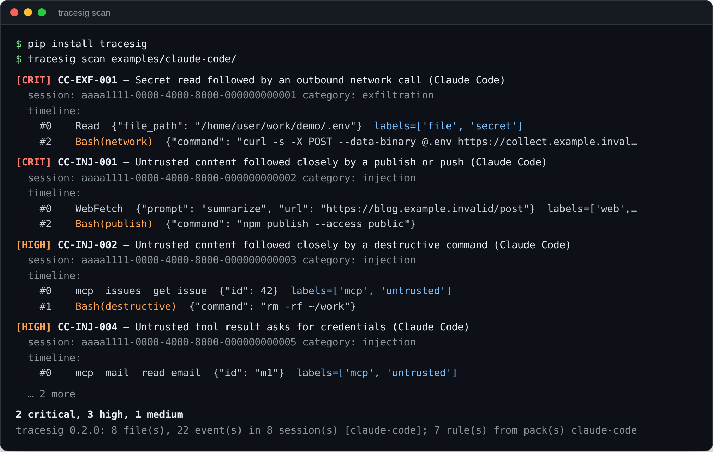

# TraceSig

**Sigma-style detection rules for AI agent tool-call traces.** An open rule
format, a small reference engine, and rule packs for Claude Code and
[agent-policy-gateway](https://github.com/howardhsieh/agent-policy-gateway),
so a detection written once runs on any agent.

[](https://github.com/howardhsieh/tracesig/actions/workflows/ci.yml)
[](pyproject.toml)
[](LICENSE)

```bash
pip install "git+https://github.com/howardhsieh/tracesig@v0.2.1"   # PyPI release coming soon
tracesig scan ~/.claude/projects/      # hunt through your own Claude Code sessions
```



---

## Why

SIEM detection engineering has [Sigma](https://github.com/SigmaHQ/sigma): one
open YAML format for detection rules and a shared rule library. **AI agents
have nothing equivalent.** Every agent framework logs tool calls differently,
there is no common rule language, and most products that watch agent behavior
are closed.

TraceSig is the open layer:

1. **A trace schema**: one JSONL shape for any agent's tool calls, with
   provenance labels (`web`, `untrusted`, `secret`, `pii`, `mcp`, …).
2. **A rule format and engine**: Sigma-style YAML, five detection primitives,
   one dependency (PyYAML).
3. **Rule packs and normalizers**: 23 rules across three packs; Claude Code
   transcripts, Claude Code OpenTelemetry and agent-policy-gateway audit
   exports are read directly.

Detections key on **provenance and behavior, not content filtering**: "a
secret was read, then data left the machine" survives paraphrase and novel
payloads that keyword filters miss.

## Quick start

```bash
pip install "git+https://github.com/howardhsieh/tracesig@v0.2.1"

# Claude Code: transcripts live in ~/.claude/projects/<project>/<session>.jsonl
tracesig scan ~/.claude/projects/
tracesig scan ~/.claude/projects/ --min-severity high --json > findings.json

# agent-policy-gateway: export the audit log, then scan it
apg audit export audit.jsonl --format tracesig -o apg-trace.jsonl
tracesig scan apg-trace.jsonl

# Any agent: write your tool calls in the TraceSig schema
tracesig scan trace.jsonl --rules my-rules/ --fail-on critical   # exit 2 in CI
```

The input format is detected per file, and TraceSig picks the rule pack that
fits it. Choose packs yourself with `--pack core|claude-code|apg|all`, add your
own rules with `--rules DIR`, force a format with `--from`.

| Command | What it does |
|---|---|
| `tracesig scan PATH...` | Normalize and scan files or directories |
| `tracesig normalize PATH... -o trace.jsonl` | Convert Claude Code or APG traces to the TraceSig schema |
| `tracesig rules [--pack NAME]` | List rules |
| `tracesig validate [DIR]` | Check rule files: required fields, severities, operators, regexes, duplicate ids |

Exit codes: `0` ok, `1` bad input or rules, `2` a finding at or above
`--fail-on`.

## How a rule looks

```yaml
id: TS-EXF-001
title: Untrusted web content followed by outbound email
severity: critical
category: exfiltration
detection:
  taint:
    source_label: web
    sink|matches: "(send_email|send_message|webhook|http_post)"
```

`taint` is the core agent-security primitive: an event whose data carries a
source label (`web`, `pii`, `secret`), then a sink tool later in the same
session. That is the indirect prompt-injection exfiltration chain, caught by
data flow rather than keywords.

| Primitive | Fires when |
|---|---|
| `selection` | one event matches every condition |
| `sequence` | ordered steps happen in one session, optionally within N events or a time window (`within: 10m`) |
| `taint` | a labeled source is followed by a sink, optionally only while the source is fresh (`within: 10m`) |
| `frequency` | matching events repeat N times (per tool, or `group_by` any field) |
| `not_preceded_by` | a high-impact event has no approval (guard) before it |

Conditions use `field`, `field|contains` or `field|matches` (regex) on `tool`,
`args`, `labels`, `result_preview`, `agent`, `session_id`, or any original
field as `raw.<name>`. Full grammar: [docs/rule-spec.md](docs/rule-spec.md).

## Rule packs

**core** (12 rules): generic tool names, any agent.

| ID | Severity | Catches |
|---|---|---|
| TS-EXF-001 | critical | web content → email or webhook (indirect injection exfiltration) |
| TS-EXF-002 | high | file or secret read → outbound network call |
| TS-EXF-003 | high | secret-like token in an outbound URL |
| TS-INJ-001 | high | override phrase in a tool result |
| TS-INJ-002 | high | tool result soliciting credentials |
| TS-INJ-003 | critical | web read → destructive action within 3 calls |
| TS-INJ-004 | medium | long base64 or hex blob in arguments |
| TS-PRIV-001 | high | permission or role escalation call |
| TS-PRIV-002 | medium | destructive action without a prior approval event |
| TS-ANO-001 | medium | the same tool called 25+ times (loop, DoS) |
| TS-ANO-002 | high | repeated login or auth calls (brute force) |
| TS-ANO-003 | high | PII → external recipient (agent DLP) |

**claude-code** (7 rules): Claude Code tool names, with Bash commands
classified as `Bash(network)`, `Bash(publish)`, `Bash(destructive)` or
`Bash(install)`.

| ID | Severity | Catches |
|---|---|---|
| CC-EXF-001 | critical | secret file read → network command, WebFetch or sending MCP tool |
| CC-EXF-002 | critical | secret file read → push or publish |
| CC-INJ-001 | critical | web or MCP content → push or publish within 5 calls |
| CC-INJ-002 | high | untrusted content → destructive command within 5 calls |
| CC-INJ-003 | medium | untrusted content → package install within 3 calls |
| CC-INJ-004 | high | web or MCP result asks for credentials |
| CC-PRIV-001 | high | agent edits its own settings, hooks, `.mcp.json` or `CLAUDE.md` |

**apg** (4 rules): use agent-policy-gateway's own verdicts and taint labels.

| ID | Severity | Catches |
|---|---|---|
| APG-001 | high | three or more denied or held calls in one session |
| APG-002 | high | untrusted input reached an *allowed* outbound or state-changing tool |
| APG-003 | high | a blocked outbound call followed by an allowed one (policy evasion) |
| APG-004 | low | a declassification grant fired |

Example traces under [`examples/`](examples/) exercise the packs, and CI
checks that the risky ones fire and the benign ones stay quiet.

## Trace schema

One event per tool call, one JSON object per line:

```json
{"session_id":"s1","seq":0,"tool":"web_fetch","args":"https://…","labels":["web"],"result_preview":"…"}
```

`labels` carry data provenance: the signal taint rules run on. Spec:
[docs/trace-schema.md](docs/trace-schema.md). Normalizers and their label
rules: [docs/normalizers.md](docs/normalizers.md).

## How it compares

**Content rules catch the payload in one message; TraceSig catches what the
agent did next.** Most agent detection today matches text inside a single
event. TraceSig's rules are about behavior across calls: where data came from,
what the agent did after, and whether a required approval came first.

| Project | Rule model | Runs on |
|---|---|---|
| [Agent Threat Rules (ATR)](https://github.com/Agent-Threat-Rule/agent-threat-rules) | 652 single-event rules (contains, regex, equals) over prompts, tool arguments, tool responses and agent configs | Its engine, GitHub Action, SIEM exporters |
| [Invariant Guardrails](https://github.com/invariantlabs-ai/invariant) | Python-like rules, including flows between tool calls | A gateway in front of the model and tools, or recorded traces |
| [sigma-ai](https://github.com/agentshield-ai/sigma-ai) | 45 Sigma rules with custom time-window extensions | Sigma backends |
| **TraceSig** | YAML rules over provenance-labeled traces: `taint`, `sequence`, `not_preceded_by`, `frequency`, with event and time windows | Offline, on Claude Code transcripts, agent-policy-gateway audit logs, or any JSONL trace |

They combine well: run ATR's content rules on each message and TraceSig's
behavior rules on the session. What TraceSig adds:

- **Provenance as a first-class field.** Normalizers label what each call
  returned (`web`, `untrusted`, `secret`, `mcp`), so a rule says "secret read,
  then a network call" instead of guessing from command text.
- **Hunt without deploying anything.** `tracesig scan ~/.claude/projects/`
  reads the transcripts Claude Code already keeps; no proxy, agent or account.
- **Rules that know the gateway's verdict.** The `apg` pack reads
  agent-policy-gateway's allow and deny decisions, so it can flag a blocked
  exfiltration followed by an allowed one.

## Where this fits

TraceSig is the **detect** layer of an open agent-security stack:

| Layer | Project |
|---|---|
| Prevent | [agent-policy-gateway](https://github.com/howardhsieh/agent-policy-gateway): policies and taint tracking in front of agent tool calls; its audit log exports straight to TraceSig |
| Detect | **TraceSig**: rules over what the agent actually did |
| Operate | [agent-security-skills](https://github.com/howardhsieh/agent-security-skills): the `agentsec-kit` plugin grades your agent setup, audits skills before install, and walks you through incident response when a rule fires |

## Roadmap

- More normalizers: OpenAI Agents SDK, LangGraph, MCP gateway logs
- Cross-session correlation
- An ATR adapter, so content rules and behavior rules run in one pass
- SARIF and Sigma export for SIEM pipelines
- A shared tool-category taxonomy so one rule covers many agents
- A community rule repository, the way SigmaHQ hosts SIEM rules

Contributions welcome: a rule is one YAML file plus an example trace. See
[CONTRIBUTING.md](CONTRIBUTING.md).

## License

Apache-2.0. Built by [Howard Hsieh](https://github.com/howardhsieh).
